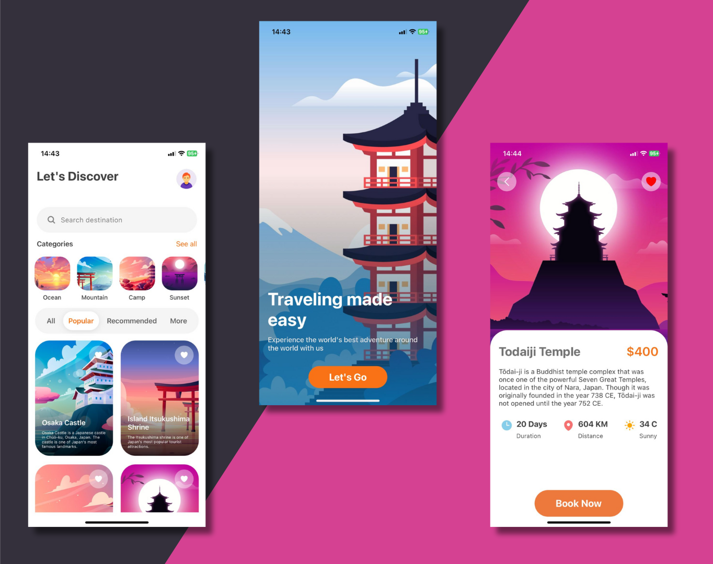

<h1 align='center'>Travel App Ui</h1>



# Description
<p>Code With Densingh</a></p>
An app to book trips around the World.

- Made for me to understand and learn more about React Native and real Navigations

# Get Started
- Clone the repository by `git clone https://github.com/Desingh-123/Travel_Application`
- Install dependencies `npm i`
- Run `npm start` and run the project in Expo GO app

# Tecnologies 
<div align='center'>
    
    
    
</div>

# Dependencies
- React Navigator
- NativeWind
- TailWindCss
- HeroIcons
# Travel Companion - React Native Mobile App for Android

Welcome to the **Travel Companion** app! This is a React Native-based mobile application tailored for Android devices. It helps users explore destinations, plan trips, and manage their travel itineraries conveniently.

## 📱 Features

- **Explore Destinations**: Discover popular and offbeat destinations with detailed information.
- **Itinerary Planner**: Plan your trips with a customizable itinerary feature.
- **Booking System**: Book accommodations, activities, and transport directly within the app.
- **User Profiles**: Save travel preferences and manage past and upcoming trips.
- **Offline Access**: Access essential trip information even without an internet connection.
- **Interactive Maps**: Navigate and explore nearby attractions seamlessly.
- **Notifications**: Get reminders, travel tips, and special deals.
- **Multi-Language Support**: Available in multiple languages for global users.

---

## 🛠️ Tech Stack

- **Frontend**: React Native (JavaScript)
- **Backend**: Firebase / Node.js for APIs (optional for data sync and authentication)
- **Database**: Firestore or SQLite for offline capabilities
- **State Management**: Redux or React Context
- **Navigation**: React Navigation
- **UI Components**: Styled with libraries like React Native Paper or Native Base
- **APIs**: Integration with third-party travel and map APIs (e.g., Google Maps, OpenWeather)

---

## 🚀 Getting Started

Follow these steps to set up the project on your local machine:

### Prerequisites

- Node.js (>=16.x)
- npm or yarn
- Android Studio (for emulator and debugging)
- React Native CLI or Expo CLI (as per project setup)

### Installation

1. Clone the repository:
   ```bash
   git clone https://github.com/Densingh-123/travel-companion.git

   📂 travel-companion/
├── 📁 android/                # Android-specific files
├── 📁 assets/                 # Fonts, images, and other static assets
├── 📁 components/             # Reusable UI components
├── 📁 screens/                # Individual app screens
├── 📁 navigation/             # Navigation logic (React Navigation)
├── 📁 redux/                  # Redux state management (optional)
├── 📁 services/               # API calls and services
├── 📁 utils/                  # Utility functions
├── App.js                     # Entry point of the app
├── package.json               # Project dependencies and scripts
└── README.md                  # Project documentation

